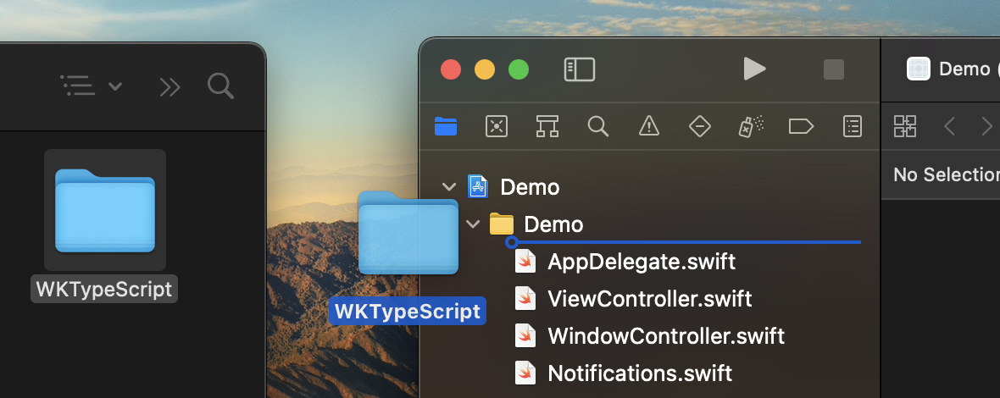
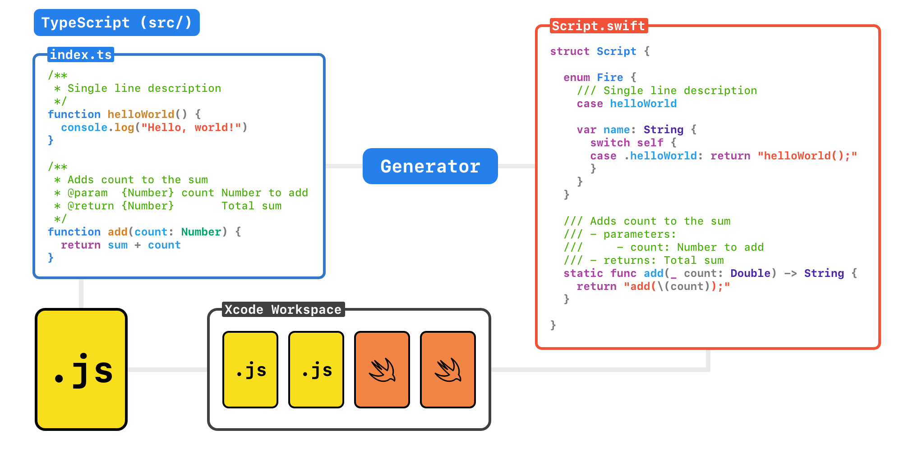
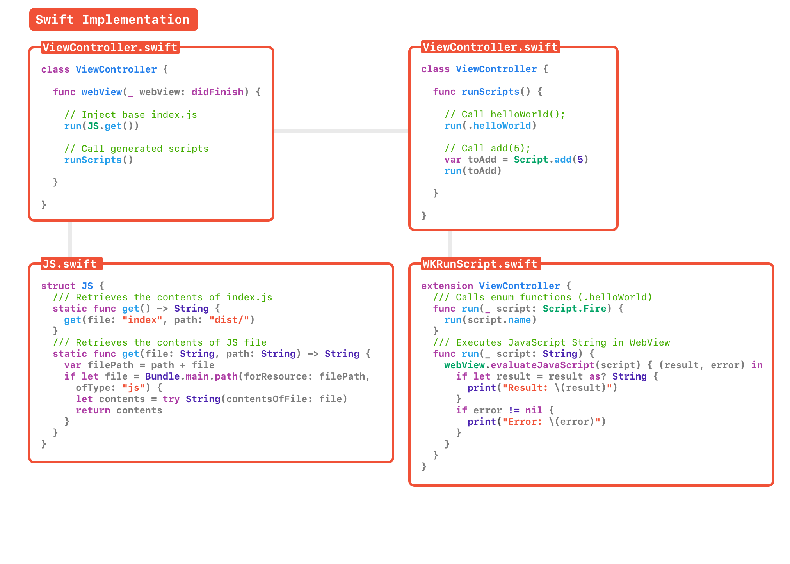

# WKTypeScript
A lightweight framework for evaluating TypeScript through WebKit using transpiled type-safe functions in native Swift.

## Table of Contents
1. **[Overview](#overview)**
2. **[Getting Started](#getting-started)**
    1. [Install](#install)
    2. [Build](#build)
    3. [Add to Xcode](#add-to-xcode)
    4. [Import JavaScript](#import-javascript)
    5. [Interact with WebKit](#interact-with-webkit)
3. **[WKTS Structure](#wkts-structure)**

# Overview

<table><tr>
  <th>User.ts</th>
  <th>User.swift</th>
</tr>
<tr><td>
            
```ts
function toggle() {}
function setLabel(text: string) {}
function addNumbers(a: number, b: number) {}
function get(name: string, verified: boolean) {}

// polymorphic function
function new(
    name: string = "John",
    verified: boolean = false
){}
```
        
</td><td>

```swift
.toggle()
.setLabel(text: String)
.addNumbers(a: Double, b: Double)
.get(name: String, verified: Bool)

// polymorphic function
.new(
    var name: String? = "John",
    var verified: Bool? = false
)
```

</td></tr></table>

<table><tr>
  <th>Call in TypeScript</th>
  <th>Call in Swift</th>
</tr>
<tr><td>
            
```ts
//
// import global

toggle()
setLabel("Hello, world!")
addNumbers(5, 10)
get("John", true)
```
        
</td><td>

```swift
let webView = WKWebView()
webView.ts(load: .global)

webView.ts(.toggle())
webView.ts(.setLabel("Hello, world!"))
webView.ts(.addNumbers(5, 10))
webView.ts(.get("John", true))
```

</td></tr></table>

## Getting Started

### Install

In your project workspace: `git clone https://github.com/inter-ops/WKTypeScript.git`

```
cd WKTypeScript
npm install
```

### Build

`npm run build` will parse the TypeScript files in `src/` and generate `Swift/WKTypeScript`. This directory contains a native Swift implementation of all your delcared TypeScript functions, constants and variables. 

```
npm run build
```

It was also transpile the TypeScript files into JavaScript files, with default output directory: `dist/`. If you decide to change this, make sure to also change `WKTSConfig.swift`:

Next, we'll be importing this into Xcode so that we can make easy calls like `webView.ts(.myFunction())`

### Add to Xcode
Drag and drop the generated `Swift/WKTypeScript` directory into the Xcode project window.



There is no dedicated package as of yet, so make sure to check `Copy items if needed` and create Groups.

### Import JavaScript

Drag and drop the newly generated `dist/` directory, with all of your transpiled JavaScript, into your project directory.

For this option, you can select `Create folder reference` to avoid having to bring in the newly generated TypeScript each time. An easier alternative is in the TODOs.


### 5. Interact with WebKit

You can now load and call these TypeScript functions, in some `webView` object, by simply calling `webView.ts(file: .myFunction)`

<table><tr>
  <th>Delcare in TypeScript</th>
  <th>Call in Swift</th>
</tr>
<tr><td>
            
```ts
function toggle() {}
function setLabel(text: string) {}
function hideObject(hidden: boolean = false) {}
function addNumbers(a: number, b: number) {}
function userStatus(name: string, verified: boolean) {}
```
        
</td><td>

```swift
.toggle()
.setLabel(_ text: String)
.hideObject(_ hidden: Bool = false)
.addNumbers(_ a: Double, _ b: Double)
.userStatus(_ name: String, _ verified: Bool)
```

</td></tr></table>

## WKTS Structure



### Type-Safe Calls to JavaScript with Native Swift




## Configuration

### Xcode
Add Xcode config overview:

- [ ] Add Build Phases
- [ ] Include transpiled JavaScript files

## Progress
- [ ] JavaScript type-safe function reference generator for native Swift
- [x] Create example iOS project
- [x] Create example macOS project
- [ ] Create cross-platform example project
- [ ] Make a better README

## Requirements

### Swift
- iOS 11 or later
- macOS 10.14 or later

### NPM
- Required?
- Node packages?

## MIT License

```
Permission is hereby granted, free of charge, to any person obtaining a copy
of this software and associated documentation files (the "Software"), to deal
in the Software without restriction, including without limitation the rights
to use, copy, modify, merge, publish, distribute, sublicense, and/or sell
copies of the Software, and to permit persons to whom the Software is
furnished to do so, subject to the following conditions:

The above copyright notice and this permission notice shall be included in
all copies or substantial portions of the Software.

THE SOFTWARE IS PROVIDED "AS IS", WITHOUT WARRANTY OF ANY KIND, EXPRESS OR
IMPLIED, INCLUDING BUT NOT LIMITED TO THE WARRANTIES OF MERCHANTABILITY,
FITNESS FOR A PARTICULAR PURPOSE AND NONINFRINGEMENT. IN NO EVENT SHALL THE
AUTHORS OR COPYRIGHT HOLDERS BE LIABLE FOR ANY CLAIM, DAMAGES OR OTHER
LIABILITY, WHETHER IN AN ACTION OF CONTRACT, TORT OR OTHERWISE, ARISING FROM,
OUT OF OR IN CONNECTION WITH THE SOFTWARE OR THE USE OR OTHER DEALINGS IN
THE SOFTWARE.
```
