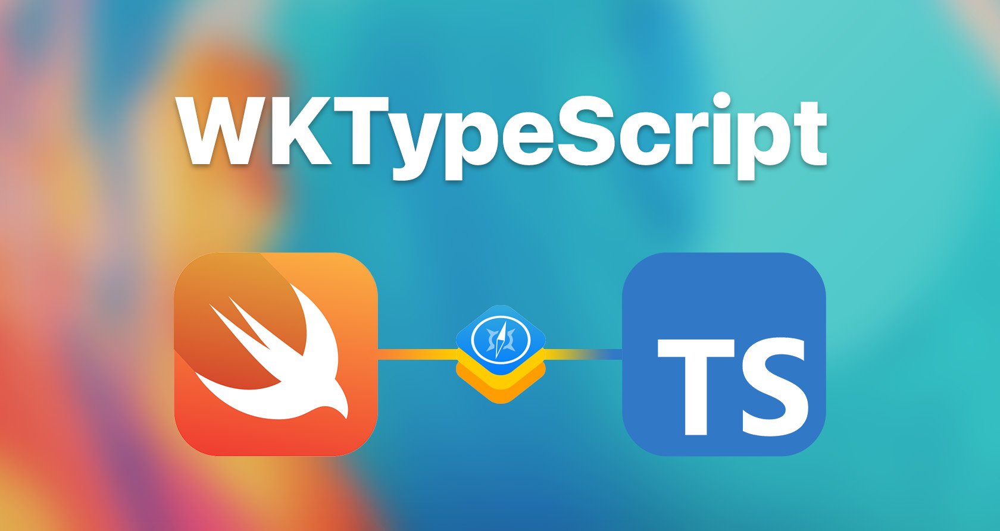
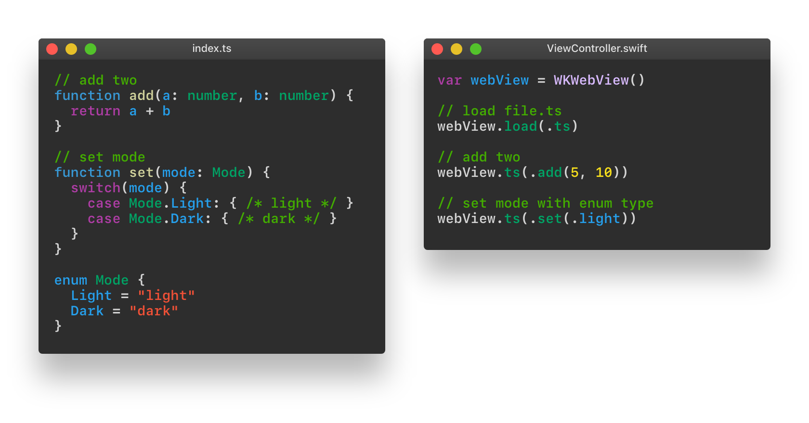

<sup>InterOps – automate your workflow (or something).</sup>

Bridge the gap between TypeScript and Swift – a Node.js generator and WebKit extension framework, all in one.

# Overview
Declare your functions in TypeScript. Call them, with type-safe parameters, in native Swift.

<!---->

**WKTypeScript** allows you to automate and streamline your TypeScript-Swift workflow. Go from declaring code in TypeScript, to implementing them in native Swift – with `npm run build` in the middle.

<!---->

<!--
## Table of Contents
1. **[Getting Started](#getting-started)**
    1. [Setup](#setup)
    2. [Building](#building)
2. **[Configuration](#configuration)**
    1. [Xcode](#xcode)
3. **[Progress](#progress)**
4. **[Requirements](#requirements)**
    1. [Swift](#swift)
    2. [NPM](#npm)
5. **[License](#mit-license)** 
-->

## Evluate in WebView
```swift
webView.ts(.myVar)
webView.ts(.myFunc())
webView.ts(.myCallback(.forSomeVal)) { (result) in
    switch result {
        case success: print("\(success)")
    }
}

```

### Setup
Setup here.

### Building
Building here.

## Configuration
Config here.

## Progress
- [x] JavaScript type-safe function reference generator for native Swift
- [x] Create example iOS project
- [x] Create example macOS project
- [x] Create cross-platform example project
- [ ] Make a better README

## Requirements

### Swift
- iOS 11 or later
- macOS 10.14 or later
