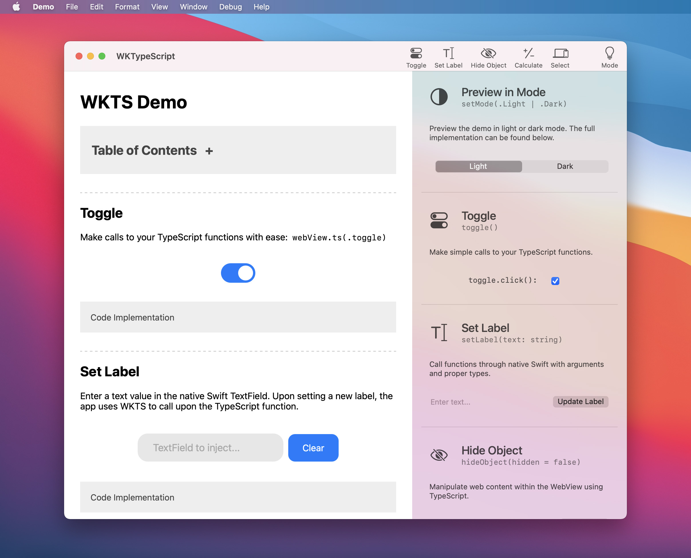
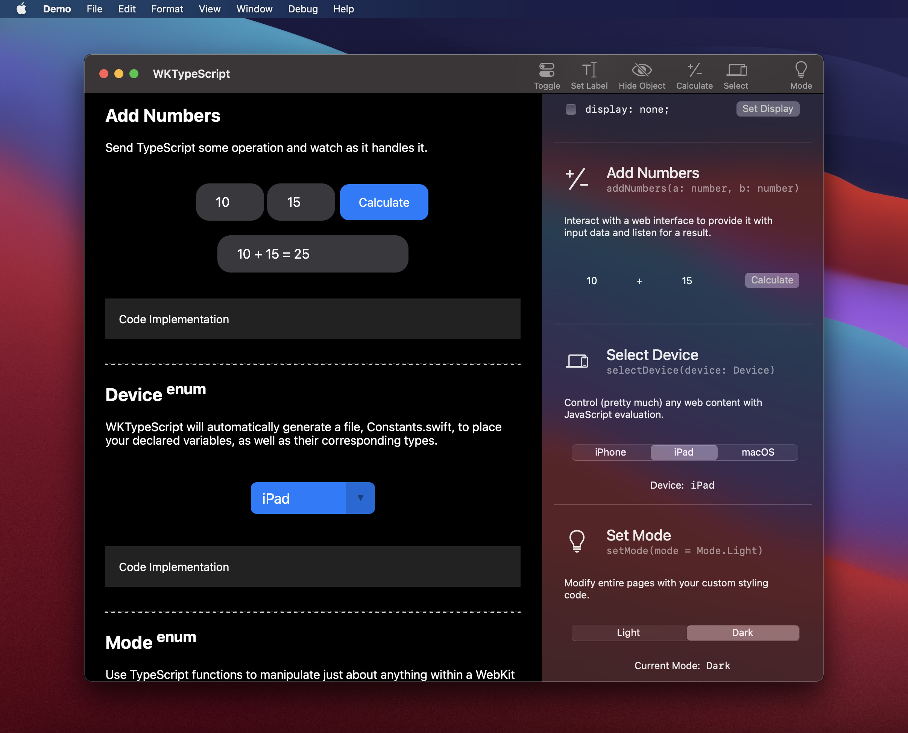

# WKTypeScript Demo Projects

The purpose of these demo projects are to showcase the utilization of WKTypeScript to bridge the gap between WebKit, TypeScript and native Swift.

<!--

-->

Imagine being able to have an Xcode project in which both TypeScript and native Swift work hand-in-hand; all whilst maintaining their own type-safe nature. It goes a little something like this:

### 1. Setup Environment

The ideal Xcode development environment is ultimately up to you, but here's an example:

```
Project.xcodeproj
Project/
	ViewController.swift
WKTypeScript/               // These files are generated by Swift.ts
	TypeScript.swift        // Swift.ts Controller that references your .ts code
	Functions.swift         // TypeScript functions are turned into native Swift
	Constants.swift         // TypeScript constant types (ie. enum) with defaults
src/
	index.ts, ...
dist/
	index.js

@ignore extra npm stuff...
```

However, as you will see in the Demo Projects, they can also be embedded within the project.

**Swift.ts** will parse your TypeScript upon running `npm run build` (you can also add it to your Xcode Build Rules) and will generate three Swift files: `TypeScript.swift`, `Functions.swift` and `Constants.swift`.

### 2. Swift.ts Generator

#### `Functions.swift`

This is where Swift.ts will convert all of your TypeScript functions into callable, native Swift functions with proper types as paramaters.

We'll dive deeper into this later, but first, why don't we start with an example! Let's say you have this TypeScript function:

```
async function setLabel(text: string) {
  const textField = <HTMLInputElement>document.getElementById("LabelTextField")
  textField.value = text
  ...
}
```

Swift.ts will automatically generate **Functions.swift** as such:

```
struct Functions {
    static func setLabel(_ text: String) -> String {
        "setLabel(\"\(text)\");"
    }
}
```


The WKTSGen 


We have provided two example projects, each running a version of the app optimized for all iOS, iPadOS and macOS platforms. The two projects share the same codebase and present the same web content to be manipulated by the TypeScript code.?

## Project Hierarchy
- `iOS/`: Example app for iOS and iPadOS
- `macOS/`: Example app for macOS
- `Shared/`: A shared codebase for the iOS, iPadOS and macOS example projects
- `WebContent/`: A shared example web project presented in all example projects

## Shared
The shared codebase allows for a number of possibilities, with the three most important being:

- **[Script.swift](Shared/Script.swift):** A database of TypeScript functions that allow for us to make type-safe calls, to said functions, through native Swift
- **[JSManager.swift](Shared/WebKit/JSManager.swift):** Handles all content retrieval of the compiled JavaScript (`dist/`)
- **[WKRunScript.swift](Shared/WebKit/WKRunScript):** Handles the execution of the compiled JavaScript code through WebKit

In a brief, the process for running a TypeScript function through some WebKit object:

1. Call a TypeScript function from **Script** (type-safe)
2. **Script** will retrieve the function code via **JSManager**
3. **WKRunSript**'s `run()` method will execute the JavaScript

### [Script.swift](Shared/Script.swift) <sup>enum</sup>
This is where all of the TypeScript functions are configured and stored in plain text. The Script enum allows for us to make calls to a type-safe function that is located in the generated TypeScript file.

In the Example apps, we use a TypeScript function, `toggleMode()`, to manipulate the contents of the WKWebView (see [index.ts](https://github.com/inter-ops/WKTypeScript/blob/main/src/index.ts) for the raw code).

```
enum Script {
    
  case toggleMode
  
  var name: String {
    switch self {
    case .toggleMode: return "toggleMode();"
    }
  }
}
```

Ah! This enum screams high-maintenance! Don't worry...

Each case, as well as their corresponding values, are automatically generated from functions in the TypeScript file. If you plan on using WKTypeScript as intended, you shouldn't have to ever touch this file.

The enumerated implementation, however, allows for us to make type-safe calls to raw TypeScript/JavaScript functions in native Swift.

```
func run(script: Script) {
  webView.evaluateJavaScript(script.name)
  ...
}
```
This implementation will allow us to make type-safe calls to TS/JS functions such as:

```
run(script: .toggleMode)
```

A full implementation of [Script.swift](Shared/Script.swift) can be found in the [Shared](Shared/) directory.

### [JSManager.swift](Shared/WebKit/JSManager.swift) <sup>struct</sup>
**JSManager** – shortened to `JS` for quicker access – allows us to retrieve the contents of a compiled JavaScript file and ready it for use with **WKRunScript**.

Since we are using a TypeScript configuration, we have already set the default file and path:

```
struct JS {
  static let index = "index"      // index.js (default)
  static let path = "dist/"       // path/to/js
  ...
}
```
Where `index.js` and `dist/` are both referenced-to in the example projects, despite being at the root of this repository.

#### `JS.get()`

Whether it be for generic use cases, or the desire for all-encompassing functionality compressed into a single file, `JS.get()` is all you need. Once the TypeScript has been transpiled from `index.ts` to `index.js`, this function will return the contents of that compiled JavaScript file at `dist/index.js`.

#### `JS.get(file: String)`
If you are working with multiple TypeScript files for a more spread-out configuration of your project, this variation will return the contents of the input JavaScript file from within the `dist/` directory.

#### `JS.get(file: String, path: String)`
Retrieve the contents of any compiled JavaScript file from the specified custom path.

### [WKRunScript.swift](Shared/WebKit/WKRunScript.swift) <sup>extension</sup>
About WKRunScript...
